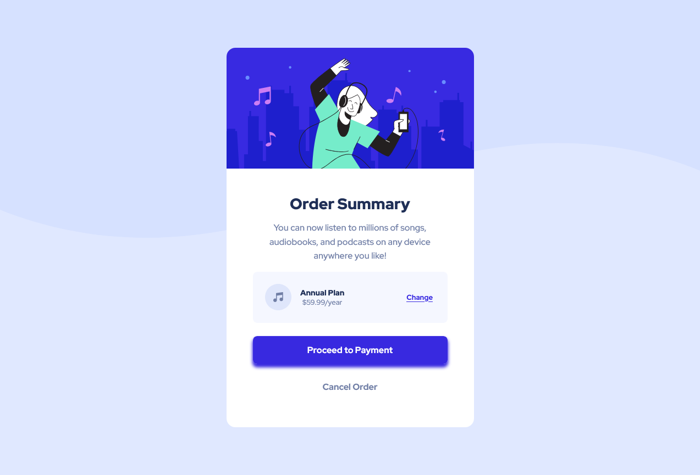

# Frontend Mentor - Order sumary card solution 

This is a solution to the [Order summary card challenge on Frontend Mentor](https://www.frontendmentor.io/challenges/order-summary-component-QlPmajDUj). Frontend Mentor challenges help you improve your coding skills by building realistic projects. 

## Table of Contents 
- [Overview](#overview)
  - [The challenge](#the-challenge)
  - [Screenshot](#screenshot)
  - [Links](#links)
- [My process](#my-process)
  - [Built with](#built-with)
  - [What I learned](#what-i-learned)
- [Author](#author)

## Overview 

### The challenge 

Users should be able to:

- See hover states for interactive elements



### Links
- Solution URL: (https://github.com/bccpadge/Order-Summary-Component.git)
- Live Site URL: [Add live site URL here](https://bccpadge.github.io/Order-Summary-Component/)


## My Process

## Built with 

- Semantic HTML5 markup
- CSS custom properties
- Flexbox
- CSS Grid
- Mobile-first workflow

### What I learned 
- I did not set font size to 62.5% on html tag in css. I used the defualt font size of 16px.  
```css
.proud-of-this-css {
  font-size: 1rem;
}
```

## Author

- Frontend Mentor - [@bccpadge](https://www.frontendmentor.io/profile/bccpadge)